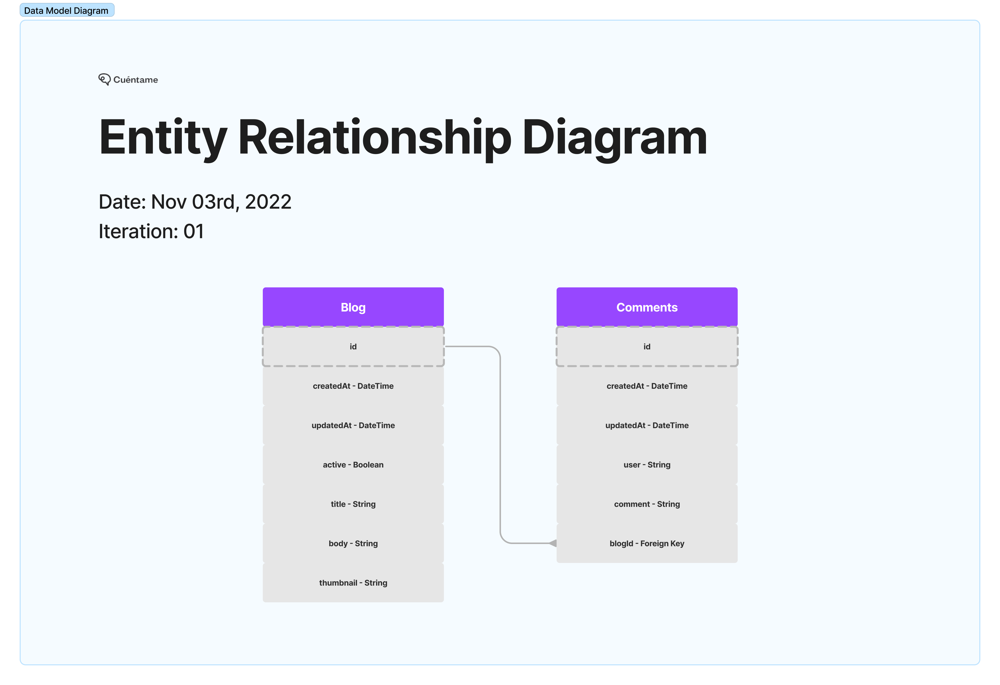

# Blog API ✍️

<h2 align="center">
    
   
</h2>

## Comments 🎙
In order to run this application is important to create a `config.env` inside `/src/config/config.env`. 
The `env` file needs to contain the next environment variables:

- PORT=5000
- RDS_HOST
- RDS_USER
- RDS_PASSWORD
- RDS_PORT
- RDS_DATABASE

This app can be run on a `development` environment using the command `npm run dev`

The app can be accessed on localhost with the url: `https://localhost:5000/` 

🚨 **The postman documentation can be found <a href="https://documenter.getpostman.com/view/16133899/2s8YYCv69Q/">here</a>🚨**

## Technologies 💡
⚡️ Nodejs \
⚡️ Express \
⚡️ MySQL \
⚡️ Jest \
⚡️ Postman

## Methodologies 🧬
⚡️ Clean code \
⚡️ Unit Testing (AAA) \
⚡️ Dessign Patterns (Singleton) \
⚡️ Algorithms and Data Structures \
⚡️ Git Flow (Manual Implementation) 

## Acknowledgments 🎁
I was motivated to build this project thanks to the <a href="https://sicuentame.com/">Cuentame</a> job application. I wanted to showcase my skills as developer:
- I can build from the idea stage to final product
- Follow good practices and strive for clean code 
- I am a well rounded developer that is always looking for technical excellence 🏁

